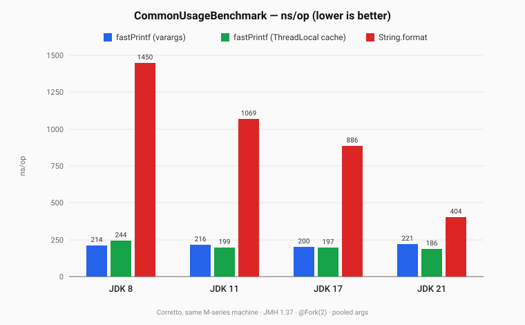

# fast-printf

[](https://github.com/YuyuZha0/fast-printf/actions/workflows/maven.yml)
[](https://codecov.io/github/YuyuZha0/fast-printf)
[](https://search.maven.org/artifact/io.github.yuyuzha0/fast-printf)
[](https://openjdk.java.net/legal/gplv2+ce.html)

A fast, allocation-light, `glibc`-style `printf` for Java 8+.

**Compile once, format many times.** fast-printf trades a one-time parsing cost for a tight, type-specialised
formatting loop that's **1.8–6.8× faster than `String.format()`** (depending on JDK) and allocates **~50% less
garbage** per call. Designed for hot paths — high-throughput logging, text-protocol serialization, real-time systems —
where `String.format()` shows up in a profile or GC trace.

## Contents

- [Quick Start](#quick-start)
- [Why fast-printf?](#why-fast-printf)
- [Performance](#performance)
- [Installation](#installation)
- [Usage](#usage)
- [Format String Reference](#format-string-reference)
- [How It Works](#how-it-works)
- [Differences from `String.format()`](#differences-from-stringformat)
- [Contributing](#contributing)
- [License](#license)

## Quick Start

Add the dependency (Maven):

```xml
<dependency>
    <groupId>io.github.yuyuzha0</groupId>
    <artifactId>fast-printf</artifactId>
    <version>1.2.13</version>
</dependency>
```

Compile once, format many times:

```java
import io.fastprintf.FastPrintf;

private static final FastPrintf F = FastPrintf.compile("User %s (id=%d) scored %.2f");

String s = F.format("Alice", 42, 99.5);
// → "User Alice (id=42) scored 99.50"
```

That's the whole API for typical use. The rest of this document covers the no-boxing `Args` builder, the format-string
syntax, and the design trade-offs.

## Why fast-printf?

* 🚀 **Faster than `String.format()`** on every JDK we measured — **~6.8×** on JDK 8, **~5×** on JDK 11, **~4.5×** on
  JDK 17, **~1.8–2.2×** on JDK 21 (whose rewritten `Formatter` closed most of the gap). See
  [Performance](#performance) for the full chart and table.
* 🗑️ **~50% less allocation** than `String.format` on a typical log-line — a rope-like internal data structure avoids
  intermediate strings and `char[]` copies, cutting young-gen GC pressure in hot loops.
* ⚙️ **Glibc-compatible syntax.** Follows the familiar C / C++ `printf` rules rather than `java.util.Formatter`'s
  Java-specific quirks (`%S` upper-cases the string, `%p` prints object identity, etc.).
* 💡 **Modern float formatting on every JDK.** Backports the Schubfach engine from OpenJDK 21, so `double` / `float`
  output is shortest-correctly-rounded even on Java 8.
* ⛓️ **No-boxing fluent API** for primitive-heavy call sites: `Args.create().putInt(...).putDouble(...)` skips the
  `Integer.valueOf` / `Double.valueOf` allocations that varargs forces.
* 🧩 **Zero runtime dependencies.** Compatible with Java 8 and newer.

**Reach for it when** you have a hot `String.format` call site — high-throughput logging, text-protocol serialization
(CSV / log lines / metrics), or any latency-sensitive code where formatting shows up in a profile or GC trace.
For everyday formatting where the bytes-per-second don't matter, the standard `String.format()` is fine.

## Performance

Benchmarked with `CommonUsageBenchmark` (JMH 1.37, `@Fork(2)`, Corretto on a single M-series box). The format string
`[%s] %s id=%d latency=%.3fms` is a realistic log-line case mixing literal text with `%s`, `%d`, and `%.Nf`; the same
string is fed to both `FastPrintf.compile(...)` and `String.format(...)` — no per-side translation or workarounds.

<p align="center">
  
</p>

### Cross-JDK numbers

| Path                                         | JDK 8         | JDK 11         | JDK 17        | JDK 21      |
|----------------------------------------------|--------------:|---------------:|--------------:|------------:|
| `fastPrintf` (varargs)                       | ~214 ns       | ~216 ns        | ~200 ns       | ~221 ns     |
| `fastPrintf` (`Args` builder, no-boxing)     | ~326 ns       | ~251 ns        | ~247 ns       | ~247 ns     |
| `fastPrintf` (with `ThreadLocal` cache)      | ~244 ns       | ~199 ns        | ~197 ns       | ~186 ns     |
| `String.format`                              | **~1450 ns**  | **~1069 ns**   | **~886 ns**   | **~404 ns** |
| **Speedup — varargs vs `String.format`**     | **~6.77×**    | **~4.95×**     | **~4.43×**    | **~1.83×**  |
| **Speedup — TL cache vs `String.format`**    | **~5.94×**    | **~5.38×**     | **~4.50×**    | **~2.17×**  |

Two things the regression makes obvious:

1. **fast-printf is essentially JDK-version-invariant on the varargs path** (214 → 216 → 200 → 221 ns). The library
   owns its performance — it doesn't piggy-back on Hotspot improvements.
2. **`String.format` got 3.6× faster between JDK 8 and JDK 21.** Most of that win is concentrated in the JDK 21
   `Formatter` rewrite (allocation also drops from 2776 B/op on JDK 17 to 1280 B/op on JDK 21). That alone explains
   why fast-printf's relative advantage shrinks on modern JDKs — fast-printf didn't slow down, the JDK closed the gap.

The `Args` no-boxing builder is the one fast-printf path that meaningfully improves between JDK 8 and JDK 11
(326 → 251 ns) — JDK 11+'s better small-method inlining helps its chained calls. After that it plateaus.

### Allocation profile (JDK 21)

Time isn't the whole story. Allocation bytes-per-op, measured with `-prof gc`:

| Path                                         | Time     | Allocation |
|----------------------------------------------|---------:|-----------:|
| **`fastPrintf` (varargs)**                   | **~221 ns** |  696 B/op |
| `fastPrintf` (`Args` builder, no-boxing)     |     ~247 ns |  592 B/op |
| `fastPrintf` (with `ThreadLocal` cache)      |     ~186 ns |  608 B/op |
| `String.format`                              |     ~404 ns | 1280 B/op |

fast-printf allocates roughly **half** the bytes `String.format` does on this workload — and on JDK 21, where the
nanoseconds gap is narrowest, the GC-pressure gap is what carries the win in production code.

### Design notes on the optional paths

**The `Args` builder (no-boxing).** ~18 ns slower per call than varargs in the table above, yet ~15 % fewer bytes
per op. That's the trade: replace primitive boxing (`Integer.valueOf`, `Double.valueOf`) and the varargs `Object[]`
with a direct fluent chain at the cost of a few extra method-dispatch hops. In JMH hot loops TLAB allocation is
nearly free, so varargs looks faster; in sustained-throughput production code the lower allocation rate reduces
young-gen GC frequency and improves p99 latency. **Pick it when allocation rate is your bottleneck**, not when
single-call nanoseconds are.

**`enableThreadLocalCache()`.** Reuses one `StringBuilder.value` `char[]` across calls. In a tight reuse loop (as
measured above) it's a net win; in code that does meaningful allocation or touches unrelated memory between
`format()` calls, that cached buffer gets cache-evicted and the path can match or *underperform* the non-cached one.
See `ComplexFormatLocalityBenchmark` for the locality breakdown. **Benchmark in your own workload before enabling.**

## Installation

**Maven:**

```xml
<dependency>
    <groupId>io.github.yuyuzha0</groupId>
    <artifactId>fast-printf</artifactId>
    <version>1.2.13</version>
</dependency>
```

**Gradle:**

```groovy
implementation 'io.github.yuyuzha0:fast-printf:1.2.13'
```

## Usage

The core idea is to compile a format string once into a `FastPrintf` instance and reuse it for all subsequent formatting
operations. Instances are immutable and thread-safe.

```java
import io.fastprintf.Args;
import io.fastprintf.FastPrintf;

public class Example {
    // Compile once and reuse. The FastPrintf instance is immutable and thread-safe.
    private static final FastPrintf FORMATTER =
            FastPrintf.compile("User %s (id=%d) scored %.2f");

    public static void main(String[] args) {
        // 1. Using varargs — simple and convenient
        String r1 = FORMATTER.format("Alice", 42, 99.5);
        System.out.println(r1);
        // → User Alice (id=42) scored 99.50

        // 2. Using the fluent Args builder — maximum performance, no boxing
        Args primitiveArgs = Args.create()
                .putString("Alice")
                .putInt(42)
                .putDouble(99.5);
        String r2 = FORMATTER.format(primitiveArgs);
        System.out.println(r2);
        // → User Alice (id=42) scored 99.50
    }
}
```

For richer formatting — uppercase strings (`%S`), zero-padding (`%05d`), hex (`%#08X`), date/time (`%t{...}`), etc. —
see the [Format String Reference](#format-string-reference) below.

### Convenience vs. maximum performance

| Style                                         | Boxing?          | Optimises for         | When to use                                                                          |
|-----------------------------------------------|------------------|-----------------------|--------------------------------------------------------------------------------------|
| `FORMATTER.format(123, "test")` (varargs)     | Yes (primitives) | CPU throughput        | Most call sites; readability wins.                                                   |
| `Args.of(123, "test")`                        | Yes (primitives) | CPU throughput        | Same as varargs; useful when you build args incrementally.                           |
| `Args.create().putInt(123).putString("test")` | **No**           | Allocation rate / GC  | Hot serialization or logging paths where young-gen pressure / p99 latency dominates. |

All three produce identical output. The choice is **CPU throughput vs allocation rate**, not "good vs better": the
no-boxing builder allocates ~15% less but costs ~18 ns of method-dispatch per call (see
[Design notes on the optional paths](#design-notes-on-the-optional-paths)). Pick based on which axis your workload is
actually bound on.

## Format String Reference

Format string syntax:
`%[flags][width][.precision]specifier[{date-time-pattern}]`

### Custom date/time formatting

The `%t` / `%T` specifiers accept an inline `DateTimeFormatter` pattern.

* **Syntax**: `%t{pattern}`
* **Example**: `%t{yyyy-MM-dd'T'HH:mm:ss.SSSZ}`
* **Default**: If no pattern is provided (`%t`), an appropriate ISO formatter is chosen based on the argument type
  (e.g. `ISO_OFFSET_DATE_TIME` for a `ZonedDateTime`).

### Specifiers

| Specifier  | Output                                                                                  | Example                      |
|:----------:|-----------------------------------------------------------------------------------------|------------------------------|
| `d` or `i` | Signed decimal integer                                                                  | `392`                        |
|    `u`     | Unsigned decimal integer                                                                | `7235`                       |
|    `o`     | Unsigned octal                                                                          | `610`                        |
|    `x`     | Unsigned hexadecimal integer (lowercase)                                                | `7fa`                        |
|    `X`     | Unsigned hexadecimal integer (uppercase)                                                | `7FA`                        |
| `f` / `F`  | Decimal floating point                                                                  | `392.65`                     |
|    `e`     | Scientific notation (lowercase `e`)                                                     | `3.9265e+2`                  |
|    `E`     | Scientific notation (uppercase `E`)                                                     | `3.9265E+2`                  |
| `g` / `G`  | Shortest representation of `%e` or `%f`                                                 | `392.65`                     |
| `a` / `A`  | Hexadecimal floating point (lowercase/uppercase `p`)                                    | `-0xc.90fep-2`               |
|    `c`     | Character                                                                               | `a`                          |
|    `s`     | String of characters (from `Object.toString()`)                                         | `sample`                     |
|    `S`     | String of characters, **converted to uppercase**                                        | `SAMPLE`                     |
| `t` / `T`  | Date/Time string (case affects final string output)                                     | `2023-12-31T23:59:59+01:00`  |
|    `p`     | Object "pointer" (class name + identity hash). Throws an exception for primitive types. | `java.lang.Integer@707f7052` |
|    `n`     | Nothing printed. The argument is consumed.                                              |                              |
|    `%`     | A literal `%` character                                                                 | `%`                          |

### Flags

|    Flag     | Description                                                                                                                                                                              |
|:-----------:|------------------------------------------------------------------------------------------------------------------------------------------------------------------------------------------|
|     `-`     | Left-aligns the result within the field width.                                                                                                                                           |
|     `+`     | Forces the result to be prefixed with a sign (`+` or `-`), even for positive numbers. Overrides the space flag.                                                                          |
| ` ` (space) | Prefixes positive numbers with a space. Ignored if the `+` flag is present.                                                                                                              |
|     `#`     | Alternate form:<br>• `o` → prefixes with `0`<br>• `x` / `X` → prefixes with `0x` / `0X`<br>• `f`, `e`, `g` → forces a decimal point<br>• `g` / `G` → prevents stripping of trailing zeros |
|     `0`     | Pads the output with leading zeros (instead of spaces) to meet the specified width. Ignored if `-` is present or if precision is specified for an integer.                               |

### Width and precision

| Field        | Description                                                                                                                                                                                                                                                              |
|:-------------|--------------------------------------------------------------------------------------------------------------------------------------------------------------------------------------------------------------------------------------------------------------------------|
| `width`      | Minimum characters to print. Padded with spaces (or zeros with `0` flag). Never truncates. `*` reads width from the next `int` argument.                                                                                                                                 |
| `.precision` | For each type:<br>• **Integers** — minimum number of digits (zero-padded)<br>• **Floats (`f`, `e`)** — digits after the decimal point<br>• **Floats (`g`)** — max significant digits<br>• **Strings (`s`, `S`)** — max characters to print<br>`.*` reads precision from the next `int` argument. |

## How It Works

The performance of `fast-printf` comes from four architectural pillars:

1. **Ahead-of-time compiler.** `FastPrintf.compile()` parses the format string once into a list of optimised
   `Appender` objects. Parsing never re-runs.
2. **Zero-copy string building.** An internal rope-like `Seq` data structure concatenates formatted parts with
   lightweight wrappers instead of copying characters. The final `String` is rendered in a single pass.
3. **Ahead-of-time argument processing.** The `Args` object converts arguments into a list of `FormatTraits` —
   specialised, type-aware handlers. This eliminates `instanceof` checks and reflection from the formatting loop.
4. **Backported float engine.** Incorporates OpenJDK 21's `DoubleToDecimal` (the "Schubfach" algorithm) so `double` /
   `float` output is correctly rounded and shortest-possible on every supported JDK.

### Modern float formatting on every JDK

`String.format()` on JDKs prior to 18 has known issues converting `double` / `float` to decimal: the output is not
always the shortest, correctly-rounded representation, which can introduce subtle accuracy bugs in scientific or
financial code. fast-printf backports the modern Schubfach-based engine from OpenJDK 21, so that correctness
guarantee — and the performance that comes with it — is available even on Java 8.

## Differences from `String.format()`

fast-printf intentionally differs from Java's `String.format` to align with `glibc` conventions and to keep the
formatting loop tight:

* **Glibc vs Java `Formatter` conventions.** Follows `glibc` `printf`. For example, `%S` upper-cases the string —
  unlike Java's behaviour, which is tied to `Formattable`.
* **`%p` (pointer) specifier.** Provides the C-style `%p` specifier to print an object's identity. Not available in
  `String.format()`. The implementation is type-safe and throws on a primitive argument, preventing auto-boxing bugs.
* **No argument indexing.** `%2$s` and friends are not supported; arguments are consumed sequentially for performance.
* **No locale support.** Formatting is locale-agnostic for performance (`.` is always the decimal separator).

## Contributing

Found a bug or have an idea? File it at the
[issue tracker](https://github.com/YuyuZha0/fast-printf/issues). Pull requests welcome.

## License

`fast-printf` is licensed under the **GNU General Public License v2 with Classpath Exception**, the same license used by
the OpenJDK.

This choice of license is deliberate, as this library includes internal utility classes that are derivative works of
OpenJDK (specifically for high-fidelity floating-point formatting). These backported files retain their original
copyright headers and are governed by the terms of the GPLv2+CE, and thus the library as a whole adopts this license.
